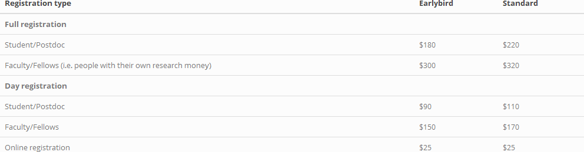

#### Wednesday 14th – Friday 16th December

#### Australian National University, Canberra

The exact location is shown [here](AES_map.pdf)

**[AES Research Excellence Awards](excellence_awards.md) are now closed**.

AES 2022 will be a face-to-face conference (with online options) held at the Australian National University, Canberra.

We aim to provide a covid-safe, inclusive environment where Evolutionary Biologists can present their research and engage with each other in open discussions and friendly debates (please see Equity and Inclusion section below). We welcome people from all career stages, including parents and those that identify with traditionally under-represented groups.

Because we know that travelling plans need to start soon, we have made a [general program](Program_2022.md) available, so that you get an idea of what we are planning. Some small details of times might change, but the general schedule and starting/finishing times will be these. The conference will **start on the Wednesday Dec 14th at mid-day**. 

**Registration opens**: 1st of September

Register **[here](https://aes.corsizio.com/c/6305473446e7234776af02db)**

**Early bird registration is closed**: note that we are now in the thick of organising the conference, so registrations beyond this point will not be considered for talks or travel grants

**Final registration closes**: 1st of December

#### Registration fees

All registration fees are in Australian dollars and are inclusive of GST.

**_In person registration includes_**: Welcome drinks, conference activities, morning tea, lunch, afternoon tea

**_Online registration includes_**: online access to conference activities, the opportunity to present your work

#### Conference Dinner

We are organizing an outdoor, end of conference gathering where we can relax a little and celebrate a week of listening to awesome science with awesome people.

**Location**: Pollen Café, Botanic Gardens (15 minute walk from conference venue)

**Time**: 7 – 11pm, Friday 16th December

**Cost**: $85 per person (paid when you register)

**Inclusions**: Canapés, drinks, music and dancing

#### Presentations

Many awesome talks were submitted, and we are now working hard on organising the program. There will be four types of presentation at AES 2022.

- ECR plenaries: 30 minute presentations showcasing the most exciting science being done by ECR members of the AES community

- Tag-team talks: ~40 min talks given by several members of the same research group (4/5), talking about related research topics that can be told as a whole story

- Long talks: 10 mins + 3 mins questions

- Flash talks: 3 mins + a shared question time

#### Accomodation 

See this [page](accommodation.md) for details.

#### Equity and Inclusion

We are really keen to create an open and friendly atmosphere where everyone feels welcome. We understand that conferences are not equally accessible to everyone, and we are aiming to be as inclusive as possible.

With this in mind,

-	We are looking into options of making a **parent/child friendly** conference, if you would like to bring your children, please indicate this when you register.

-	We will be providing **travel grants** to those in need. If you would like to be considered for one of these travel grants please indicate this when you register. 

-	Unfortunately Covid is still with us. To **reduce the risk of Covid** transmission during our conference we are taking a number of precautionary measures and we hope that everyone jumps on board, so that even vulnerable members of our community can enjoy themselves. It is up to us to commit and make this a safe environment for everyone.

**Covid precautions**

-	We will be checking that participants are **vaccinated upon registration**, only participants with full vaccination scheme (at least two doses) will be allowed to attend, and we highly encourage boosters.

-	We will be wearing **masks indoors** as per ANU policy. We recommend the use of KN95s or other highly protective masks.

-	We will provide **free RAT tests** to anyone that needs them, and we encourage attendees to get tested before the first day of the conference. In case of any symptoms (even if they are mild) please do not attend the venue. 

-	We will have **online options available** so that anyone who still feels uncomfortable, or who is ill can participate with conference activities.

If you feel that there is anything else we can do that would make you feel more comfortable attending AES2022, please get in touch, we are very open to suggestions.

Any questions please send us an email: ausevolutionsociety@gmail.com

